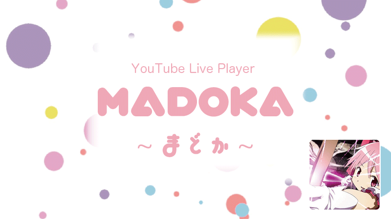
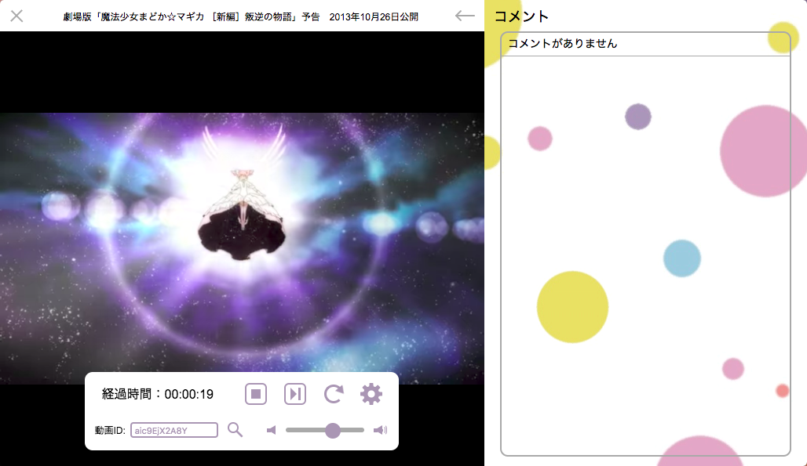

# Madoka - まどか - 

# 概要
「Madoka」はElectronで作られたYouTube Live ROM（Read Only Member）専用プレーヤーです。    
動画IDを入力することによってライブが再生され同時にコメントを取得します。  
また、「[Shuvi-lib](https://github.com/yuki540net/shuvi-lib)」というライブラリを使用することによって「YouTube IFrame Player」を操作しています。  

# ダウンロード
  - [GitHub - Releases](https://github.com/minakawa-daiki/Madoka/releases/tag/v0.1.0)

# 使い方

  - 再生  
    プレーヤー上にマウスカーソルを持って行くと操作ウィンドウが出現するので動画IDを入力し、「エンターキー」か「検索」ボタンを押すと再生されます。
    
  - コメント  
    プレーヤー右上の「ハンバーガーメニュー」マークを押すとコメントウィンドウが開きます。  
    コメントは「YouTube Data API」を用いて取得しています。  
    コメントウィンドウを閉じるときは「←」マークを押すと閉じれます。  
    
  - 画質変更  
    操作ウィンドウの歯車マークをクリックすると変更できます。

# 記事
  - はてなブログ - [Madokaちゃん作った](http://oliver0521.hatenablog.jp/entry/2017/11/13/041257)
  - Qiita - [Electronで初めてアプリを作ってみた](https://qiita.com/minakawa-daiki/items/fc21cd01cd0feae83593)

# OS
  - OSX
  - Windows
  - Linux

# Author
[Oliver](https://minakawadaiki.com)

# Contributor
[yuki540](https://github.com/yuki540net)

# Licence
[MIT](./LICENSE)

